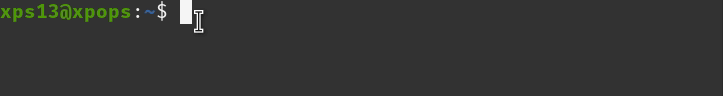

# Peek

Peek is useful for doing screen recordings and creating animated gifs from them.

<a href="https://github.com/phw/peek" target="_blank" class="md-button">Peek</a>

## Install

```sh
sudo add-apt-repository ppa:peek-developers/stable
sudo apt update
```

then install and make animated .gifs like this

